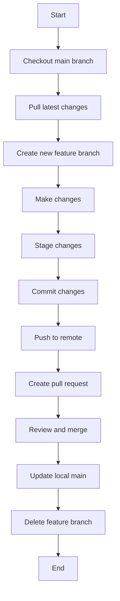

# Git Notes for Me and Joe

## Definitions

- **`main` branch**: Should always have production-ready code.
- **`branch`**: You make one of these when you want to create a new feature.
- **`stage`**: You stage a file when you are ready to commit it. It tells Git which changes you want to include in your next commit. It doesn't actually save these changes to your repository history yet.
- **`commit`**: This actually saves your changes to your repository (your local one).
- **`push`**: This is a command used to upload local repository content to a remote repository. It transfers commits from your local repository to a remote repo.


## Detailed Workflow

### 1. Starting a New Feature

```bash
# Switch to main branch
git checkout main

# Update local main branch
git pull origin main

# Create and switch to a new feature branch
git checkout -b feature-name

# Pushes branch to remote
git push --set-upstream origin
```

### 2. Making Changes

Make your changes to the code as needed.

### 3. Staging and Committing Changes

```bash
# Stage all changes in current directory and subdirectories
git add .

# Commit staged changes with a descriptive message
git commit -m "Descriptive message"
```

> **Note**: It's a two-step process because it allows you to:
> - Selectively choose which changes to include in a commit (you don't have to add all changes).
> - Review your staged changes before committing (using `git status` or `git diff --staged`).
> - Group related changes into logical commits.

### 4. Pushing Changes to Remote

```bash
# Push your commits to the remote repository
git push -u origin feature-name
```

### 5. Creating a Pull Request

Go to GitHub and create a pull request for your feature branch.

### 6. After Pull Request is Merged

```bash
# Switch back to main branch
git checkout main

# Update local main branch
git pull origin main

# Delete local feature branch
git branch -d feature-name

# Delete remote feature branch
git push origin --delete feature-name
```

## Workflow Diagram



# Keeping Your Branch Up to Date

It's crucial to keep your feature branch up to date with the main branch to avoid conflicts and ensure you're working with the latest code. Here's how to do it safely:

### Updating Your Feature Branch

When you're on your feature branch and want to update it with the latest changes from the main branch, use the following commands:

```bash
# Ensure you're on your feature branch
git checkout feature-name

# Fetch the latest changes from the remote
git fetch origin

# Merge the latest changes from main into your feature branch
git merge origin/main
```
### Will This Overwrite My Current Changes?

No, merging or pulling changes from `main` into your feature branch will not overwrite your current changes, provided:

1. Your changes are committed: If you've made commits on your feature branch, Git will attempt to merge the incoming changes with your existing work.
2. Your changes are not committed: If you have uncommitted changes, Git will prevent the merge to avoid losing your work.

However, to be safe, always follow these best practices:

1. **Commit your changes** before updating your branch.
2. If you have uncommitted changes you're not ready to commit, you can **stash** them:
   ```bash
   git stash
   git merge origin/main
   git stash pop
   ```

### Best Practices for Keeping Branches Updated

1. **Update frequently**: Pull changes from `main` into your feature branch regularly (daily or at least weekly for long-running features).
2. **Update before pushing**: Always update your feature branch with the latest from `main` before pushing your changes or creating a pull request.
3. **Resolve conflicts locally**: If there are conflicts when merging `main` into your feature branch, resolve them in your local environment before pushing.


## Conflict Resolution in Git

Conflicts occur when Git can't automatically merge changes from different branches. This typically happens when two branches have modified the same part of a file. Here's how conflict resolution works:

### When Conflicts Occur

Conflicts can arise in several scenarios:
1. When merging branches
2. When rebasing a branch
3. When pulling changes from a remote repository

### The Conflict Resolution Process

1. **Git Detects a Conflict**: When Git can't automatically merge changes, it marks the file as conflicted and halts the merging process.

2. **Identifying Conflicted Files**: Use `git status` to see which files have conflicts.

3. **Understanding Conflict Markers**: Git adds conflict markers to the affected files:
   ```
   <<<<<<< HEAD
   Your changes
   =======
   Changes from the branch you're merging
   >>>>>>> branch-name
   ```

4. **Resolving the Conflict**: 
   - Open the conflicted file in your text editor.
   - Decide which changes to keep (yours, theirs, or a combination).
   - Remove the conflict markers and edit the file to its final desired state.

5. **Mark as Resolved**: After editing, add the resolved file to the staging area:
   ```bash
   git add <resolved-file>
   ```

6. **Complete the Merge**: Once all conflicts are resolved, complete the merge:
   ```bash
   git commit
   ```

### Example of Resolving a Conflict

Let's say you're merging `feature-branch` into `main` and encounter a conflict:

```bash
git checkout main
git merge feature-branch
# Conflict occurs
```

You see:
```
Auto-merging example.txt
CONFLICT (content): Merge conflict in example.txt
Automatic merge failed; fix conflicts and then commit the result.
```

1. Open `example.txt` and you might see:
   ```
   <<<<<<< HEAD
   This is the original line in main
   =======
   This is the modified line in feature-branch
   >>>>>>> feature-branch
   ```

2. Edit the file to resolve the conflict:
   ```
   This is the resolved line combining both changes
   ```

3. Stage the resolved file:
   ```bash
   git add example.txt
   ```

4. Complete the merge:
   ```bash
   git commit
   ```

### Best Practices for Conflict Resolution

1. **Use Git Tools**: Git GUIs and IDE integrations can make conflict resolution more visual and easier to manage.
2. **Regular Integration**: Frequently merge the main branch into your feature branches to reduce the likelihood of large conflicts.


## Important Reminders

- Always ensure your `main` branch has **production-ready** code.
- Create a new branch for each feature or bug fix.
- Write clear, descriptive commit messages.
- Review your changes before committing.
- Keep your local `main` branch up-to-date before creating new feature branches.
- Delete feature branches after they're merged to keep the repository clean.
