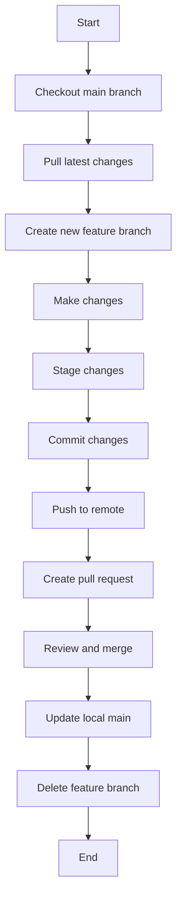

# Git Notes for Me and Joe

## Definitions

- **`main` branch**: Should always have production-ready code.
- **`branch`**: You make one of these when you want to create a new feature.
- **`stage`**: You stage a file when you are ready to commit it. It tells Git which changes you want to include in your next commit. It doesn't actually save these changes to your repository history yet.
- **`commit`**: This actually saves your changes to your repository (your local one).
- **`push`**: This is a command used to upload local repository content to a remote repository. It transfers commits from your local repository to a remote repo.

## Workflow Diagram


```mermaid
graph TD
    A[Start] --> B[Checkout main branch]
    B --> C[Pull latest changes]
    C --> D[Create new feature branch]
    D --> E[Make changes]
    E --> F[Stage changes]
    F --> G[Commit changes]
    G --> H[Push to remote]
    H --> I[Create pull request]
    I --> J[Review and merge]
    J --> K[Update local main]
    K --> L[Delete feature branch]
    L --> M[End]
```

## Detailed Workflow

### 1. Starting a New Feature

```bash
# Switch to main branch
git checkout main

# Update local main branch
git pull origin main

# Create and switch to a new feature branch
git checkout -b feature-name
```

### 2. Making Changes

Make your changes to the code as needed.

### 3. Staging and Committing Changes

```bash
# Stage all changes in current directory and subdirectories
git add .

# Commit staged changes with a descriptive message
git commit -m "Descriptive message"
```

> **Note**: It's a two-step process because it allows you to:
> - Selectively choose which changes to include in a commit (you don't have to add all changes).
> - Review your staged changes before committing (using `git status` or `git diff --staged`).
> - Group related changes into logical commits.

### 4. Pushing Changes to Remote

```bash
# Push your commits to the remote repository
git push -u origin feature-name
```

### 5. Creating a Pull Request

Go to GitHub and create a pull request for your feature branch.

### 6. After Pull Request is Merged

```bash
# Switch back to main branch
git checkout main

# Update local main branch
git pull origin main

# Delete local feature branch
git branch -d feature-name

# Delete remote feature branch
git push origin --delete feature-name
```

## Important Reminders

- Always ensure your `main` branch has **production-ready** code.
- Create a new branch for each feature or bug fix.
- Write clear, descriptive commit messages.
- Review your changes before committing.
- Keep your local `main` branch up-to-date before creating new feature branches.
- Delete feature branches after they're merged to keep the repository clean.
